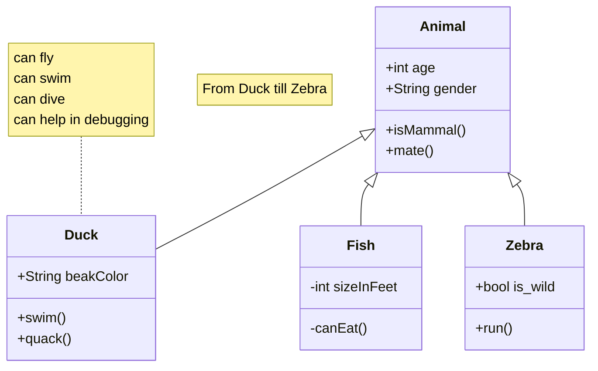

# Informatica-Parolari-Giovanni-4Bi-PYTHON
### Mermaid

  
Mermaid è un estensione che si utilizza con il linguaggio Markdown e permette di poter creare diagrammi di flusso su file md.
###### **Animal example**  



## Jupiter    

Jupyter è un ambiente di sviluppo interattivo molto usato in data science e ricerca scientifica, il nome prende dall'unione dei nomi che inizialmente supportava **_Julia, Python e R_**.
Si basa sul concetto di notebook (file .ipynb), quindi celle di codice eseguibile, testo in Markdown e output grafici, eseguibili singolarmente per vedere subito i risultati.

#### Intallazione e configurazione amibiente Jupiter

Verificare l'installazione dell'ambiente python e il gestore di pacchetti con il seguente comando

```powershell
python --version
pip3 --version
```

Attivare e abilitare i vari ambienti virtuali\pacchetti

```powershell
python3 -m venv M1_markdown_jupyter/test
pip install requests pandas
```