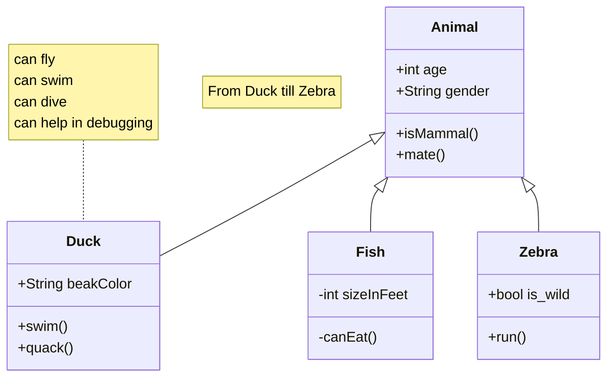

# Informatica-Parolari-Giovanni-4Bi-PYTHON
### Mermaid

  
Mermaid è un estensione che si utilizza con il linguaggio Markdown e permette di poter creare diagrammi di flusso su file md.
###### **Animal example**  


```mermaid
classDiagram
    note "From Duck till Zebra"
    Animal <|-- Duck
    note for Duck "can fly<br>can swim<br>can dive<br>can help in debugging"
    Animal <|-- Fish
    Animal <|-- Zebra
    Animal : +int age
    Animal : +String gender
    Animal: +isMammal()
    Animal: +mate()
    class Duck{
        +String beakColor
        +swim()
        +quack()
    }
    class Fish{
        -int sizeInFeet
        -canEat()
    }
    class Zebra{
        +bool is_wild
        +run()
    }
```

## Jupiter    

Jupyter è un ambiente di sviluppo interattivo molto usato in data science e ricerca scientifica, il nome prende dall'unione dei nomi che inizialmente supportava **_Julia, Python e R_**.
Si basa sul concetto di notebook (file .ipynb), quindi celle di codice eseguibile, testo in Markdown e output grafici, eseguibili singolarmente per vedere subito i risultati.

#### Intallazione e configurazione amibiente Jupiter

Verificare l'installazione dell'ambiente python e il gestore di pacchetti con il seguente comando

```powershell
python --version
pip3 --version
```

Attivare e abilitare i vari ambienti virtuali\pacchetti

```powershell
python3 -m venv M1_markdown_jupyter/test
pip install requests pandas
```


### Come installare il kernel

Sul terminale insaerire questi comandi sottoelencati:

```powershell
cd .\M1_markdown_jupyter\      
python -m venv .m1
deactivate
.\.m1\Scripts\activate #per riattivare l'ambiente
```


# ESERCIZI

### Esercizio 1 — Scheda personale di postazione

[

L'esercizio chiede di creare un file markdown denominato come [**postazione.md** ](M1_markdown_jupyter/postazione.md)dentro la cartella [**M1_markdown_jupyter** dove spiego le caratteristiche della mia macchina, seguendo una determinata scrittura.
Per il titolo impostare un testo di primo livello, le tipologie invece saranno scritte in secondo livello e tratteranno di:
 
- Hardware
- Software installato
- Credenzioali accesso ai servizi del corso(Github)


### Esercizio 2 — Istruzioni di compilazione con elenchi, comandi e citazioni

Questo esercizio chiede di creare un file [**compilare.md**](M1_markdown_jupyter/compilare.md)  lavorando sempre nella cartella **M1_markdown_jupyter**.
L'obbiettvo di questo esercizio è quello di clonare un repository random ed eseguire un programma Java.
Riportare le istruzioni qui sotto elencando numeratamente le ultime e non riducendosi a fare un elenco di almeno 5 punti.


### 